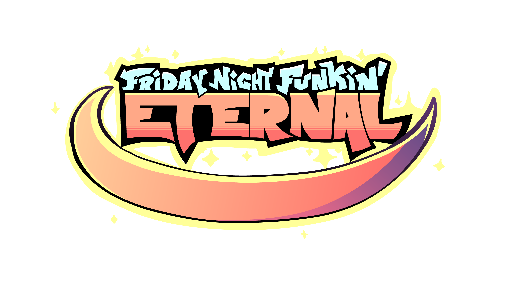

    
    <h2 align="center">Friday Night Funkin': Eternal - Crash Dialog</h2>

Simple crash dialog program built for [Friday Night Funkin': Eternal](https://github.com/Sword352/FnF-Eternal/).

> [!NOTE]
> Licensing requirements from the main project applies to this repository as well.

## Building instructions
1. Install the git version of the [haxeui-core](https://github.com/haxeui/haxeui-core) library.
2. Install the git version of the [haxeui-hxwidgets](https://github.com/haxeui/haxeui-hxwidgets) library along with it's dependencies.
3. Run `haxe build.hxml` through a command line.

> [!IMPORTANT]
> For non-64 bits architectures, comment or delete `-D HXCPP_M64` in build.hxml.

## Special Thanks
- [Betopia](https://betpowo.github.io/): Art
